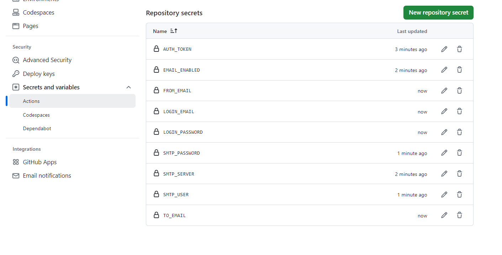
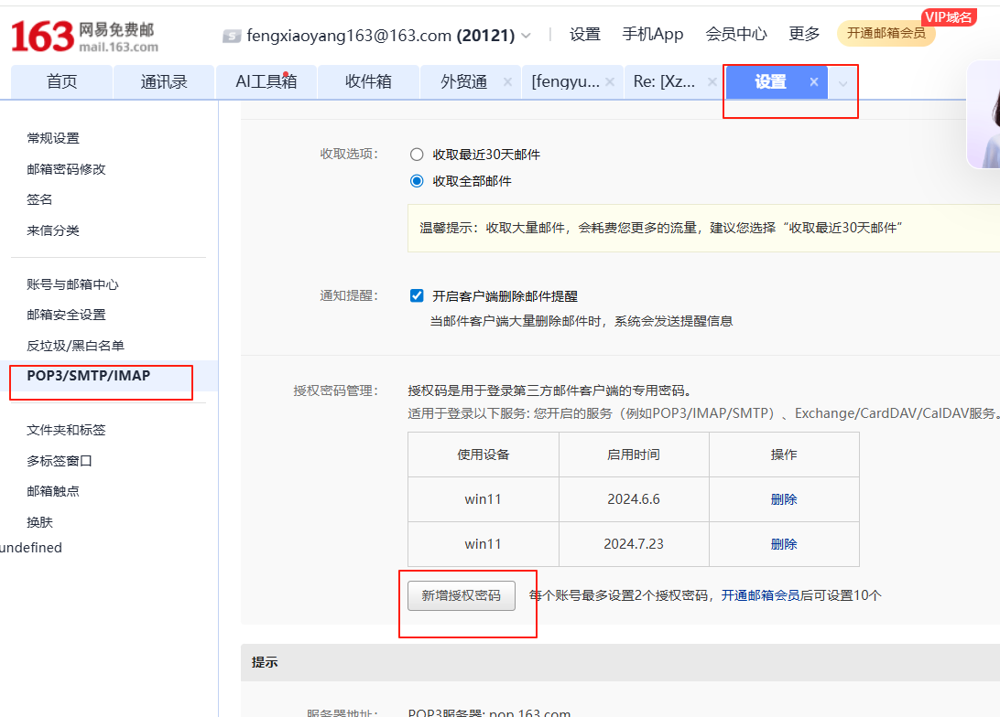
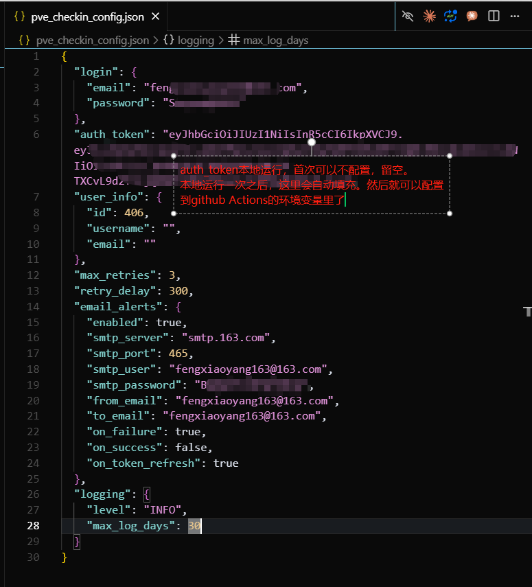

# Mirror O3 Pro 自动签到工具

[](https://github.com/features/actions)
[](https://www.python.org/)
[](LICENSE)

一个专为 [mirror.o3pro.pro](https://mirror.o3pro.pro) 网站设计的自动签到工具，支持本地部署和 GitHub Actions 云端运行。

> 基于 [billrice](https://github.com/billrice) 的原始代码开发，增加了 GitHub Actions 支持和多项功能优化。

## ✨ 特性

- 🚀 **多平台部署** - 支持 PVE/Linux 本地部署和 GitHub Actions 云端运行
- 🔄 **智能Token管理** - 自动检测Token失效并重新登录
- 📧 **邮件通知** - 支持多种SMTP服务器，包括163、Gmail等
- 🛡️ **安全可靠** - 使用GitHub Secrets管理敏感信息，配置文件加密保护
- 📊 **积分追踪** - 实时显示积分变化和余额信息
- 🔍 **详细日志** - 完整的执行日志，支持调试和故障排查
- ⚡ **防重复签到** - 基于状态文件的去重机制
- 🔧 **错误重试** - 可配置的重试次数和延迟机制

## 🚀 快速开始

### GitHub Actions 部署 (推荐)

1. **Fork 此仓库**到您的 GitHub 账户

2. **配置 Secrets**：进入仓库 Settings → Secrets and variables → Actions
   
   
   
   ```
   LOGIN_EMAIL=your_email@163.com
   LOGIN_PASSWORD=your_password
   AUTH_TOKEN=your_jwt_token
   
   # 邮件通知配置 (可选)
   EMAIL_ENABLED=true
   SMTP_SERVER=smtp.163.com
   SMTP_PORT=465
   SMTP_USER=your_email@163.com
   SMTP_PASSWORD=your_auth_code
   FROM_EMAIL=your_email@163.com
   TO_EMAIL=your_email@163.com
   ```
   
   **163邮箱授权码获取方法：**
   
   

3. **启用工作流**：Actions 页面会自动执行，每天北京时间 9:00 自动签到

### 本地部署

1. **克隆仓库**
   ```bash
   git clone https://github.com/yourusername/mirroro3_autocheckin.git
   cd mirroro3_autocheckin
   ```

2. **安装依赖**
   ```bash
   pip3 install requests
   ```

3. **配置文件**
   ```bash
   cp pve_checkin_config.json.example pve_checkin_config.json
   # 编辑配置文件，填入您的登录信息
   nano pve_checkin_config.json
   ```
   
   **配置文件示例：**
   auth-token本地运行时，首次运行会自动获取，后续运行时会自动更新。
   获取到之后，可以添加到github actions的secrets中.
   

4. **测试运行**
   ```bash
   python3 pve_checkin_cron.py --test
   ```

5. **设置定时任务** (Linux/PVE)
   ```bash
   crontab -e
   # 添加以下行 (每天上午9点执行)
   0 9 * * * /usr/bin/python3 /path/to/pve_checkin_cron.py >/dev/null 2>&1
   ```

## 📋 使用说明

### 命令行选项

```bash
# 本地版本
python3 pve_checkin_cron.py --test        # 测试模式
python3 pve_checkin_cron.py --test-email  # 测试邮件发送
python3 pve_checkin_cron.py --config=path # 指定配置文件路径

# GitHub Actions 版本
python3 github_actions_checkin.py --test  # 测试模式
```

### 邮件配置

支持多种邮件服务商：

**163邮箱配置：**
```json
{
  "email_alerts": {
    "enabled": true,
    "smtp_server": "smtp.163.com",
    "smtp_port": 465,
    "smtp_user": "your_email@163.com",
    "smtp_password": "your_authorization_code",
    "from_email": "your_email@163.com",
    "to_email": "your_email@163.com"
  }
}
```

**Gmail配置：**
```json
{
  "email_alerts": {
    "enabled": true,
    "smtp_server": "smtp.gmail.com",
    "smtp_port": 587,
    "smtp_user": "your_email@gmail.com",
    "smtp_password": "your_app_password",
    "from_email": "your_email@gmail.com",
    "to_email": "your_email@gmail.com"
  }
}
```

### 手动触发 (GitHub Actions)

1. 进入仓库的 Actions 页面
2. 选择 "Mirror O3 Pro Auto Checkin" 工作流
3. 点击 "Run workflow"
4. 选择是否启用测试模式
5. 点击 "Run workflow" 开始执行

## 📁 项目结构

```
mirroro3_autocheckin/
├── .github/workflows/
│   └── auto-checkin.yml           # GitHub Actions 工作流
├── pve_checkin_cron.py            # 主程序 (PVE/本地版本)
├── github_actions_checkin.py      # GitHub Actions 专用版本
├── pve_checkin_config.json.example # 配置文件模板
├── install_pve_checkin.sh         # 自动安装脚本
├── CLAUDE.md                      # AI 助手指南
├── GITHUB_ACTIONS_SETUP.md       # GitHub Actions 部署指南
├── PVE_DEPLOYMENT_GUIDE.md       # PVE 部署详细指南
├── PVE_README.md                  # PVE 快速部署指南
├── .gitignore                     # Git 忽略文件
└── README.md                      # 项目说明文档
```

## 🔧 配置说明

### 基础配置
- `login.email` - 登录邮箱
- `login.password` - 登录密码
- `auth_token` - JWT认证令牌 (自动更新)
- `max_retries` - 最大重试次数 (默认3)
- `retry_delay` - 重试延迟秒数 (默认300)

### 邮件通知配置
- `email_alerts.enabled` - 是否启用邮件通知
- `email_alerts.on_failure` - 签到失败时发送邮件
- `email_alerts.on_success` - 签到成功时发送邮件
- `email_alerts.on_token_refresh` - Token刷新时发送邮件

### 日志配置
- `logging.level` - 日志级别 (DEBUG/INFO/WARNING/ERROR)
- `logging.max_log_days` - 日志保留天数 (默认30天)

## 🔍 故障排查

### 常见问题

**1. 签到失败**
- 检查登录邮箱和密码是否正确
- 查看日志文件了解具体错误信息
- 使用测试模式进行调试

**2. Token 失效**
- 程序会自动处理，重新登录获取新Token
- 如果持续失败，检查账户状态

**3. 邮件发送失败**
- 检查SMTP配置是否正确
- 确认使用正确的授权码 (不是登录密码)
- 检查网络连接和防火墙设置

### 调试方法

```bash
# 本地调试
python3 pve_checkin_cron.py --test
tail -f pve_checkin_*.log

# 检查配置文件语法
python3 -m json.tool pve_checkin_config.json

# 测试网络连接
curl -I https://mirror.o3pro.pro/
```

## 📊 功能演示

```bash
$ python3 pve_checkin_cron.py --test
PVE Checkin Tool Test Mode
Config: /opt/checkin/pve_checkin_config.json
Status: /opt/checkin/pve_checkin_status.json
Log: /opt/checkin/pve_checkin_202508.log
--------------------------------------------------
2025-08-11 09:00:00,123 - INFO - 开始PVE自动签到任务
2025-08-11 09:00:01,234 - INFO - Token有效，用户: user@163.com
2025-08-11 09:00:02,345 - INFO - 签到成功! 获得 500 积分，总积分: 4000 -> 4500
Result: Success
```

## 🤝 贡献

欢迎提交 Issue 和 Pull Request 来帮助改进这个项目！

## 🙏 致谢

本项目基于 [billrice](https://github.com/billrice) 的原始代码进行开发和优化，在此表示感谢！

## 📄 许可证

本项目使用 MIT 许可证。详见 [LICENSE](LICENSE) 文件。

## ⚠️ 免责声明

本工具仅供学习和研究使用，使用者需自行承担使用风险。请遵守相关网站的服务条款和使用规定。

## 🔗 相关链接

- [Mirror O3 Pro](https://mirror.o3pro.pro) - 官方网站
- [GitHub Actions](https://docs.github.com/en/actions) - 官方文档
- [Python Requests](https://docs.python-requests.org/) - HTTP库文档